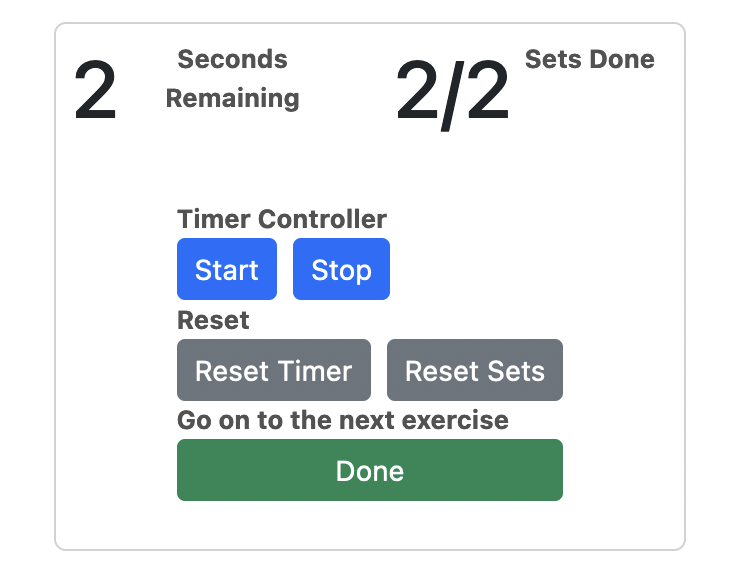
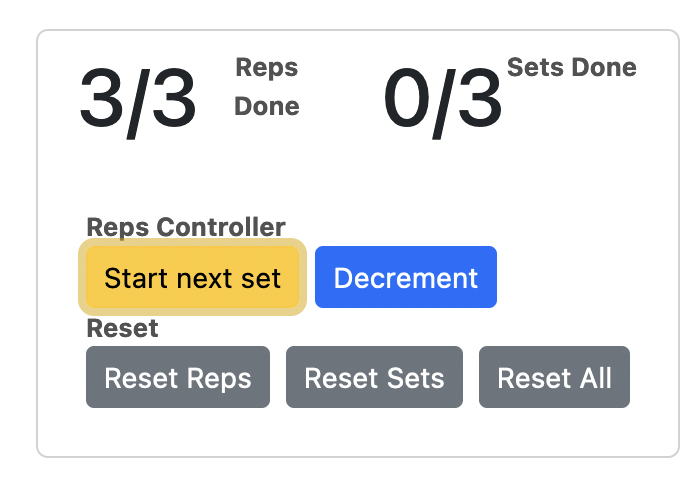
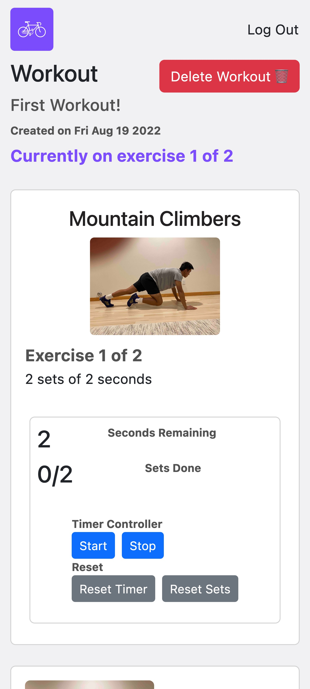

# FitMe README

### Notes:
- Brandon integrated [Formspree](https://formspree.io/) to email him whenever someone submits a new exercise idea request or contact form submission.
- If more time existed, we'd integrate a way for users to reset/recover their password. We'd also integrate more account settings capabilities such as changing an account name. Also we'd give users the ability to edit workouts, track them, and take even more images.
- Integrated [Lottie's](https://lottiefiles.com/) amazing [React library](https://www.npmjs.com/package/lottie-react) for the additional **React Library** project requirement.
- For the **External Data** part, we have created a **JSON** file (it's called `exerciseDescriptions.json`) by hand (this is our own data so no citation needed) that provides a `description`, a `name`, an `id`, and whether the exercise `isReps`.
  - The app also implements **Firebase Realtime Database** for this part of the project. It reads, writes, deletes, and observes changes to the database.
- Made custom **theme** styles in `theme.css`.
- Brandon created features for:
  - **User Authentication** (login, signup, logout, etc.)
  - **Creating Workouts** (adding exercises, removing exercises, etc.)
  - **Viewing Workouts** (viewing all workouts, viewing a specific workout, etc.)
    - **Includes workout timer and rep counter** for guiding a user through a workout
      - Users can time their time elapsed and sets 
      - Users can count their reps 

### Resources:
- The [**Lottie JSON Files**](https://lottiefiles.com/) were free to use. Here are the links for attribution:
  - [man-pushup.json](https://lottiefiles.com/75821-wide-arm-push-up)
  - [man-squat.json](https://lottiefiles.com/90054-squat-reach)
  - [woman-crunches.json](https://lottiefiles.com/29951-healthy-lifestyle-exercise)
  - [woman-leg-pushout.json](https://lottiefiles.com/95396-workout-girl)
  - [woman-cobra.json](https://lottiefiles.com/81972-cobras)
  - [thank-you-animation.json](https://lottiefiles.com/82521-thank-you)

### Learnings
- Learned how to import and use JSON in a **Node.js** project [here](https://bobbyhadz.com/blog/javascript-import-json-file).
- Learned how to use images in the `public` folder in a React project [here](https://www.webdevelopmentinstitute.com/blog/how-to-use-image-from-public-folder-in-a-react).

### Usability
- For usability purposes, Exercise information opens in a separate tab by using `target="_blank"` in the `<Link>` component.
- We implemented `alt` and `aria-label` attributes images.
- Wanted to make it a mobile-first web application that would look good on all kinds of screen sizes. 